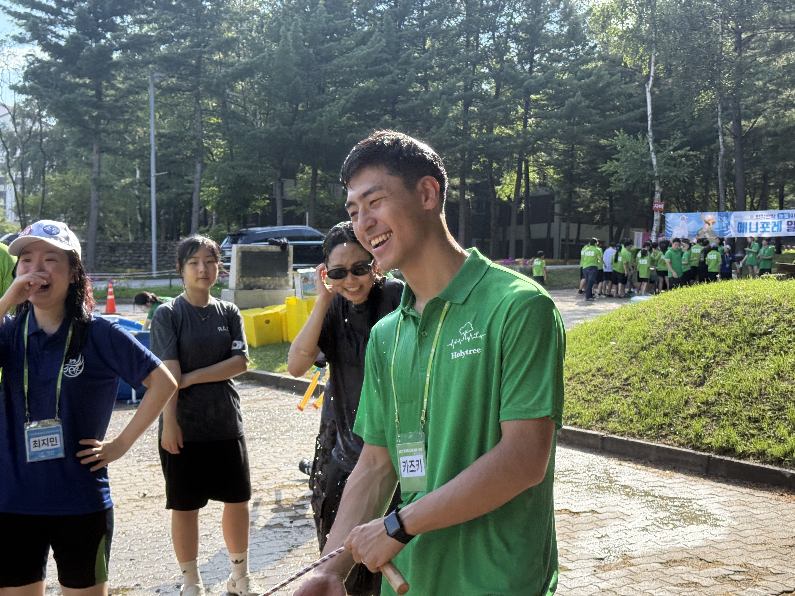

::: {.grid}

::: {.g-col-12 .g-col-md-8}
**Welcome to my digital workbench.**

I operate on a simple principle: if you cannot explain it simply, you do not understand it. This space is where I put that principle into practice.

I view constant growth as a necessity, and this blog serves as my accountability log—the final outlet in my learning process to solidify knowledge, develop my skills, and ensure I am always moving forward.

:::

::: {.g-col-12 .g-col-md-4}
{style="border-radius: 15px; max-width: 100%;"}
:::

:::

---

## Recent Posts

::: {#blog-listings}
:::